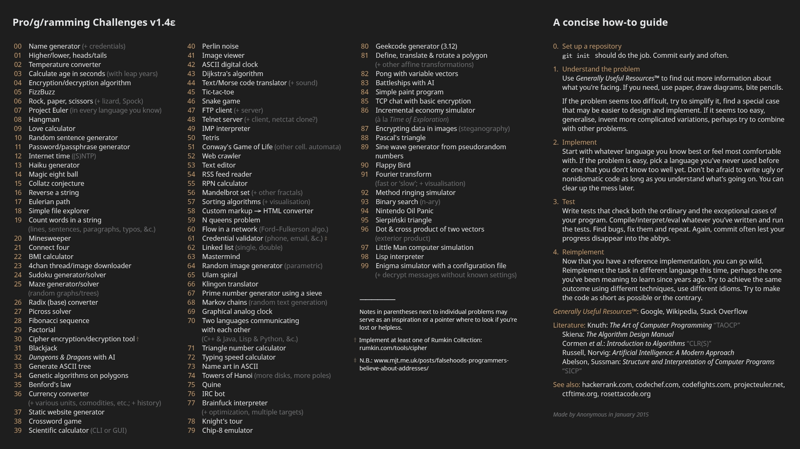

# coding-challenges

This repository contains 4 out of 100 challenges that I plan to complete this year. My goal is to keep learning, improve my skills, and become better with each challenge. All challenges are shown in the image below.

The challenges are being developed in Kotlin.

## Challenges finished
* 00 - Name Generator -
* 01 - Higher/lower -
* 02 - Temperature converter -
* 06 - Rock, paper, scissors -
